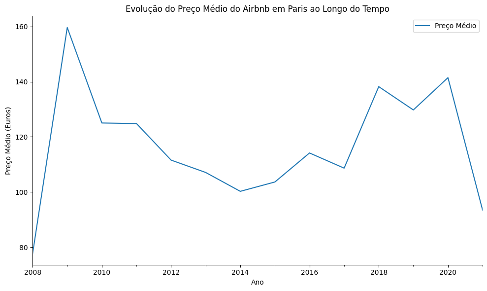
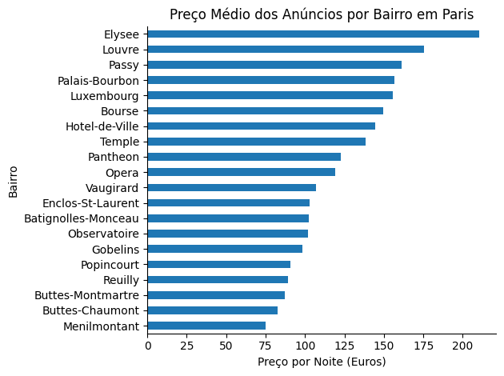
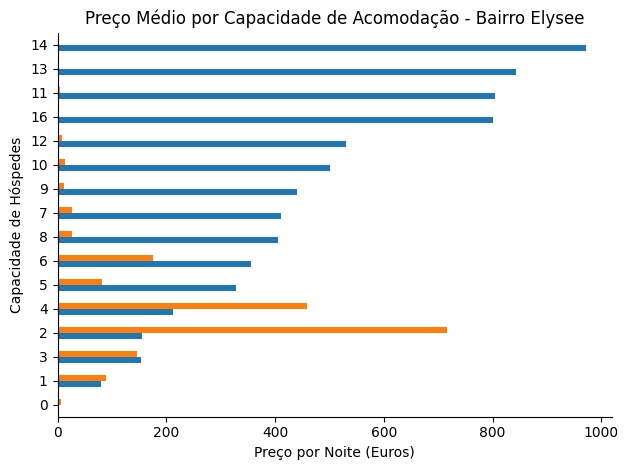
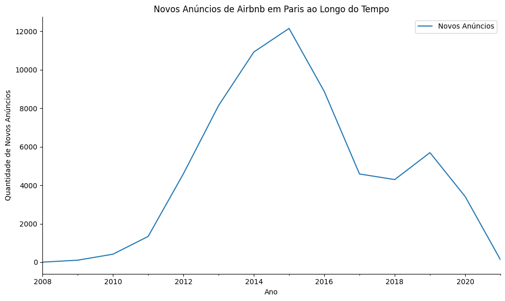
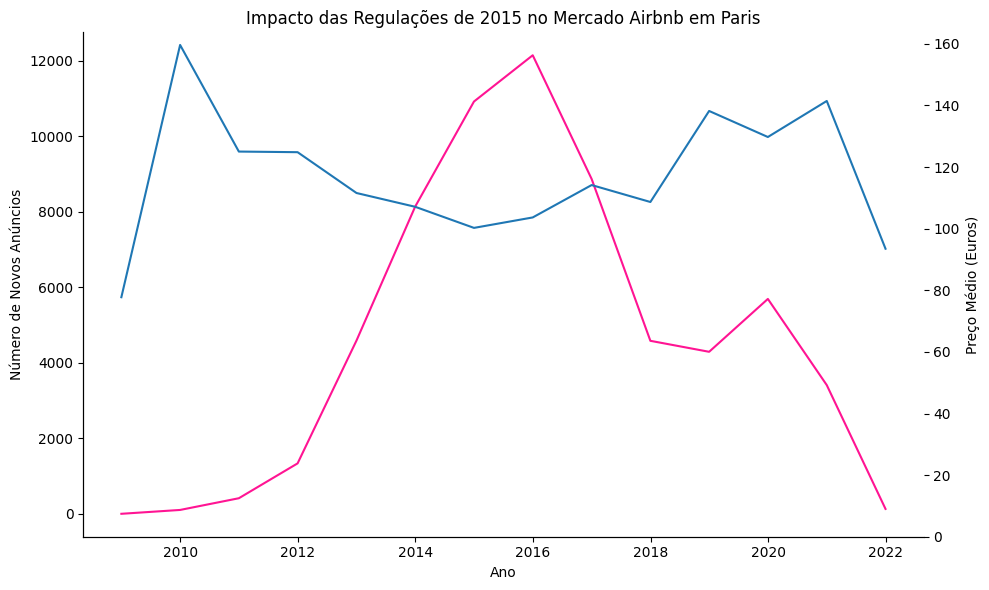

# Análise do Mercado Airbnb em Paris (Pandas) - Análise Exploratória de Dados 

## Visão Geral do Projeto:

Nesse projeto, foi buscado analisar os anúncios da cidade de Paris com foco em **liderança de preços**.

O objetivo foi criar um **resumo visual dos principais fatores que impactam a precificação** e avaliar se as regulamentações adotadas em 2015 influenciaram o mercado de locação de curta duração na cidade.

---

---

## Objetivos de Negócio:

- Identificar os principais fatores que impactam o preço dos anúncios
- Analisar diferenças de preços entre bairros
- Avaliar como a capacidade de acomodação influencia a precificação
- Investigar o impacto das regulamentações de 2015 sobre:
  - Crescimento de novos anfitriões
  - Evolução do preço médio

---

## Etapas do Projeto

### 1 Exploração e Qualidade dos Dados

- Carregamento e inspeção inicial da base
- Verificação e correção de tipos de dados
- Conversão de colunas de data para `datetime`
- Identificação e tratamento de valores ausentes
- Padronização da variável de preço

---

### 2 Preparação e Transformação dos Dados

- Filtro da base para anúncios localizados em Paris
- Criação de agregações por:
  - Bairro
  - Capacidade de hóspedes
  - Ano (análise temporal)
- Reamostragem anual para análise da evolução do mercado
- Estruturação de DataFrames específicos para visualização

---

## Visualizações:

### Preço Médio por Bairro:

Observa-se grande variação de preços entre os bairros, com regiões centrais apresentando valores significativamente superiores.

---

### Preço Médio por Capacidade de Acomodação:

Há uma relação positiva entre número de hóspedes e preço médio, indicando que imóveis maiores possuem maior valor de diária.

---

### Crescimento de Novos Anúncios ao Longo do Tempo:

Nota-se forte crescimento até 2015, seguido por desaceleração no número de novos anúncios.

---

### Evolução do Preço Médio ao Longo do Tempo:

Após 2015, o preço médio apresenta tendência de crescimento, possivelmente associado à restrição de oferta.

---

### Impacto das Regulamentações de 2015:

A análise conjunta mostra redução no crescimento de novos anfitriões e aumento no preço médio após a regulamentação.

---

## Principais Insights:

- Existe variação significativa de preços entre bairros.
- Capacidade de acomodação influencia diretamente o valor da diária.
- O mercado apresentou crescimento acelerado até 2015.
- Após a regulamentação, houve desaceleração na entrada de novos anfitriões.
- O preço médio demonstrou tendência de alta no período pós-regulação.

---

## Interpretação de Negócio:

Os resultados indicam que as regulamentações adotadas em 2015 podem ter:

- Reduzido o ritmo de entrada de novos anfitriões
- Limitado a expansão da oferta
- Contribuído para maior pressão nos preços médios

Isso sugere impacto direto das políticas públicas na dinâmica do mercado de aluguel de curta duração em Paris.

---

## Tecnologias Utilizadas:

- Python
- Pandas
- Matplotlib
- Seaborn
- Jupyter Notebook

---

## Conclusão:

Este projeto demonstra:

- Tratamento e padronização de dados
- Análise exploratória estruturada
- Análise temporal com séries históricas
- Construção de visualizações estratégicas
- Interpretação orientada a negócio

- --
## Créditos:

Este projeto foi inspirado por uma aula no YouTube que me ajudou a aprender os passos importantes de EDA com Pandas e visualização de dados.

Tutorial: https://www.youtube.com/watch?v=fwOU0lfreu8

As análises e interpretações apresentadas aqui refletem meu entendimento e aplicação prática dos conceitos aprendidos.

